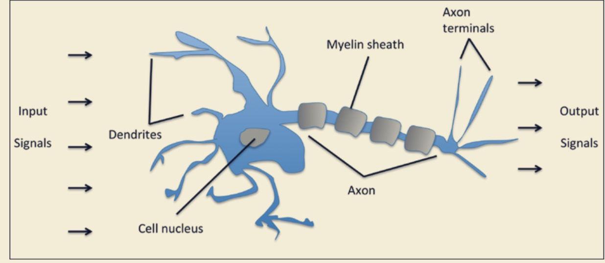

# Training Machine Learning Algorithms for Classification
训练分类机器学习算法

In this chapter, we will make use of one of the first algorithmically described machine learning algorithms for classification,  the `perceptron `and` adaptive liner neurons`.  
在这个章节,对于classification我们将使用一种算法地描述机器学习算法, `感知机` 和 `线性神经元`

We will start by implementing a perceptron step in Python and training it classify different flower species in Iris dataset.  
我们将开始使用Python在Iris数据集上一步一步的实现训练给不同的花分类的感知机. 

This will help us to understand the concept of machine learning algorithms for classification and how they can be efficiently implemented in Python  
这将帮助我们理解classification机器学习的概念,以及如何使用Python高效的实现它.

Discussing the basics of optimization using adaptive linear neurons will then lay the groundwork for using more powerful classifiers via the scikit-leaing machine-learning library in Chapter 3, `A Tour of Machine Learning Classifiers Using Scikit-learn` .  
讨论使用自适应线性神经元进行优化的基础，将为通过scikit-leaing机器学习库使用更强大的分类器奠定基础  

## 这个章节涵盖的提纲:
+ Building an intuition for machine learning algorithms  
构建对于机器学习的直觉

+ Using pandas, NumPy, and matplotlib to read in , process and visualize data  
使用 pandas,NumPy 和 matplotlib 去读取,处理, 展示数据

+ Implementing linear classification algorithms in Python  
使用Python实现线性分类算法

### Artificial neurons – a brief glimpse into the early history of machine learning
人工的神经员-简单的看一下机器学习更早的历史

Before we discuss the perceptron and related algorithms in more detail, let us take a brief tour through the early beginnings of machine learning. Trying to understand how the biological brain works to design artificial intelligence, Warren McCullock and Walter Pitts published the first concept of a simplified brain cell, the so-called McCullock-Pitts (MCP) neuron, in 1943 (W. S. McCulloch and W. Pitts. A Logical Calculus of the Ideas Immanent in Nervous Activity. The bulletin of mathematical biophysics, 5(4):115–133, 1943). Neurons are interconnected nerve cells in the brain that are involved in the processing and transmitting of chemical and electrical signals, which is illustrated in the following figure:

在我们更详细地讨论感知器和相关算法之前，让我们简单地回顾一下机器学习的早期。为了了解生物大脑是如何设计人工智能的，沃伦·麦卡洛克(Warren McCullock)和沃尔特·皮茨(Walter Pitts)在1943年发表了简化脑细胞的第一个概念，即所谓的McCullock-Pitts (MCP)神经元(W. S. McCulloch和W. Pitts)。神经活动中固有的思想的逻辑演算。数学生物物理学公报，5(4):115-133,1943)。神经元是大脑中相互连接的神经细胞，参与处理和传递化学和电信号，如下图所示:

 

McCullock and Pitts described such a nerve cell as a simple logic gate with binary outputs; multiple signals arrive at the dendrites, are then integrated into the cell body, and, if the accumulated signal exceeds a certain threshold, an output signal is generated that will be passed on by the axon.  

McCullock和Pitts将这种神经细胞描述为具有二进制输出的简单逻辑门;多个信号到达树突，然后集成到细胞体中，如果累积的信号超过某个阈值，就会产生一个输出信号，由轴突传递。

Only a few years later, Frank Rosenblatt published the first concept of the perceptron learning rule based on the MCP neuron model (F. Rosenblatt, The Perceptron, a Perceiving and Recognizing Automaton. Cornell Aeronautical Laboratory, 1957). With his perceptron rule, Rosenblatt proposed an algorithm that would automatically learn the optimal weight coefficients that are then multiplied with the input features in order to make the decision of whether a neuron fires or not. In the context of supervised learning and classification, such an algorithm could then be used to predict if a sample belonged to one class or the other.  
仅仅几年后，Frank Rosenblatt发表了基于MCP神经元模型的感知器学习规则的第一个概念(F. Rosenblatt，感知器，感知和识别自动机)。康奈尔大学航空实验室,1957)。根据感知器规则，Rosenblatt提出了一种算法，该算法可以自动学习最优权重系数，然后与输入特性相乘，以决定神经元是否触发。在监督学习和分类的上下文中，这样的算法可以用来预测一个样本是属于一个类还是属于另一个类。

More formally, we can pose this problem as a binary classification task where we refer to our two classes as 1(positive class) and -1(negative class ) for simplicity.  
更正式的说, 我们可以将问题作为一个二分分类任务, 其中可以将两个类分为1和-1,以便简化.

We can then define an `activation function` $\theta(z)$ that takes a linear combination of certain input values `x` and a 
corresponding weight vector $w$, where $z$ is the so-called net input($z = w_1x_1 + ... + w_mx_w$)

$$
\begin{split}\boldsymbol{w} =
\begin{bmatrix}
    w_1 \\
    \cdots \\
    w_m
\end{bmatrix},\quad

\boldsymbol{x} =
\begin{bmatrix}
    x_1 \\
    \cdots \\
    x_m
\end{bmatrix}
\end{split}
$$

我们可以定义一个激活函数$\theta(z)$将某一输入值 $x$ 和对应的权重向量 $w$ 结合成一条线, $z$ 就是 所谓的`net` $z = w_1x_1 + ... + w_mx_w$:

$$
\begin{split}\boldsymbol{w} =
\begin{bmatrix}
    w_1 \\
    \cdots \\
    w_m
\end{bmatrix},\quad

\boldsymbol{x} =
\begin{bmatrix}
    x_1 \\
    \cdots \\
    x_m
\end{bmatrix}
\end{split}
$$

